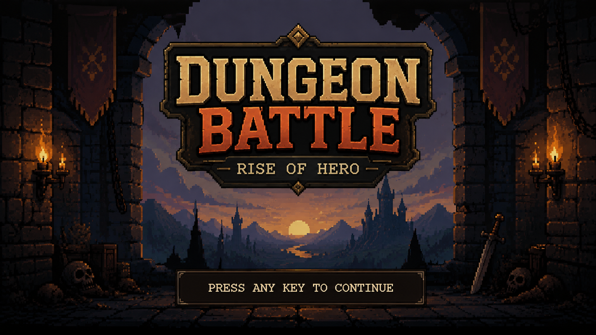
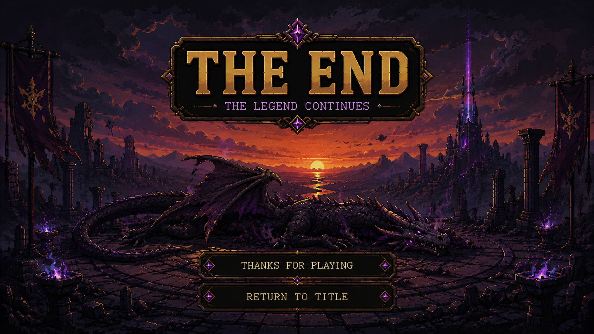

# 🗡️ Dungeon Battle: Rise of Hero

[](https://openjdk.org/)
[](https://en.wikipedia.org/wiki/Swing_(Java))
[](https://docs.oracle.com/javase/tutorial/sound/)
[](https://learn.microsoft.com/en-us/powershell/)

**Dungeon Battle: Rise of Hero** adalah game 2D Fantasy RPG berbasis pemrograman berorientasi objek (PBO) dengan antarmuka grafis Java Swing. Game ini menggabungkan penjelajahan peta dunia atas (*top-down world exploration*) menggunakan map loader TMX, sistem pertarungan bergilir (*turn-based battle system*), sound manager MIDI dinamis, dan sistem level-up pahlawan yang progresif.

---

## 📸 Screenshots & Visuals

### 🎮 Mulai Menu Utama
Menampilkan layar pembuka petualangan dengan aransemen musik orkestra MIDI yang megah.


### ⚔️ Pertarungan Sengit (Map 1 vs Map 2)
Pertarungan berbasis giliran di Map Rerumputan (Map 1) dan Map Dungeon Gelap (Map 2) yang diiringi musik bertema petualangan dan fantasi tegang.
<p align="center">
  
  
</p>

### 🏆 Layar Akhir Kemenangan (End Screen)
Layar penutup legendaris setelah pahlawan berhasil mengalahkan naga Azhrax, diiringi aransemen lagu kemenangan penutup yang damai.


---

## 🚀 Fitur Unggulan Game

- **Penjelajahan 2D Top-Down**: Menjelajahi dunia fantasi dengan map XML/TMX yang diurai secara dinamis lengkap dengan blok tabrakan (*collision blocking*).
- **Sistem Pertarungan Turn-Based**: Pertarungan GUI interaktif dengan status aksi (Serang biasa, Fireball charge, Defend aura, meminum Potion, dan melarikan diri).
- **Audio MIDI & WAV Dinamis**: Mendukung pemutaran file audio WAV lokal dan transisi instrumen MIDI synthesizer secara *real-time* jika file suara eksternal tidak ditemukan.
- **Skala Level Progresif**: Level player otomatis meningkat (s.d level 5) seiring banyaknya monster yang dikalahkan, meningkatkan Attack, Defense, dan kekuatan sihir secara dinamis.
- **Efek Visual Interaktif**: Dilengkapi dengan guncangan layar (*screen shake*), angka damage melayang (*floating text*), indikator HP kritis berkedip merah, dan animasi aura pertahanan.

---

## 🏛️ Penerapan Konsep OOP (PBO)

Game ini dirancang secara modular dan kokoh dengan mempraktikkan pilar utama Pemrograman Berorientasi Objek:

- **Encapsulation**: Menyembunyikan status sensitif (`hp`, `level`, `score`, `attackPower`) di dalam kelas menggunakan modifier akses `private` / `protected` dan membukanya secara aman melalui *getter* dan *setter*.
- **Inheritance**: Pembentukan hierarki karakter yang rapi di mana abstract class `Character` diturunkan ke kelas `Player` dan abstract class `Enemy` (yang memiliki subclass monster: `Slime`, `Golem`, `Goblin`, `OrcWarrior`, `DragonBoss`).
- **Polymorphism**: Eksekusi metode `attack()` dan `useSkill()` secara dinamis melalui tipe parent class dengan hasil dan karakteristik serangan yang berbeda-beda pada setiap tipe makhluk.
- **Method Overloading**: Menyediakan beberapa variasi metode `attack()` di kelas `Player` dengan daftar parameter parameter yang berbeda (seperti serangan biasa, bonus damage numerik, dan bonus efek skill string).
- **Interface**: Menerapkan kontrak kelayakan tempur lewat interface `Attackable` dan kemampuan sihir khusus lewat interface `SkillUser`.

---

## 📁 Struktur Direktori & Package

```text
src/fantasyrpg/
├── Main.java                        # Entry point utama aplikasi
├── GameState.java                   # State manager global game
├── entities/                        # Kelas model karakter (PBO)
│   ├── Character.java               # Abstract superclass semua karakter
│   ├── Player.java                  # Model pahlawan hero
│   ├── Enemy.java                   # Abstract superclass monster
│   └── (Slime, Golem, Goblin, OrcWarrior, DragonBoss)
├── interfaces/                      # Kontrak perilaku (Interfaces)
│   ├── Attackable.java              # Kontrak menerima damage & hidup
│   └── SkillUser.java               # Kontrak meluncurkan skill khusus
├── services/                        # Logika bisnis game (Services)
│   ├── BattleService.java           # Pengendali alur pertempuran
│   ├── EnemyFactory.java            # Factory instansiasi monster
│   └── RandomEventService.java      # Pemicu kejadian acak per ronde
├── sound/                           # Sound engine (MIDI & WAV)
│   └── SoundManager.java            # Pengelola BGM & SFX dinamis
├── ui/                              # Antarmuka pengguna grafis (Swing GUI)
│   ├── start/                       # Panel Menu Utama
│   ├── world/                       # Panel Eksplorasi 2D Top-Down
│   └── battle/                      # Panel Battle GUI Turn-Based
└── util/
    └── ConsoleFormatter.java        # Logger utilitas konsol
```

---

## 🛠️ Panduan Menjalankan & Membangun Game

### Prasyarat
- Java Development Kit (JDK) versi **17** atau yang lebih tinggi.
- Sistem Operasi Windows (dilengkapi dengan PowerShell).

### 1. Kompilasi Proyek
Untuk mengompilasi seluruh source code secara otomatis ke folder `out`, jalankan skrip PowerShell berikut di direktori root proyek:
```powershell
.\scripts\compile.ps1
```

### 2. Memulai Permainan
Setelah kompilasi sukses, Anda dapat menjalankan game melalui file batch berikut:
```cmd
start.bat
```
Atau langsung jalankan via konsol dengan perintah berikut:
```bash
java -cp out fantasyrpg.Main
```